# 🎩Телеграм бот для игры в [Мафию](https://ru.wikipedia.org/wiki/Мафия_(игра)) с большим количеством игроков и ролей (<u>более 35!</u>)

## Функциональность
### 🤔Зачем нужен бот?
Данный бот анализирует события, происходящие во время игры,
чтобы избавить игроков от необходимости вводить роль ведущего.
Интуитивно понятный интерфейс для взаимодействия ролей и общения союзников делают
бота незаменимым помощником!
### 🎲Как начать игру?
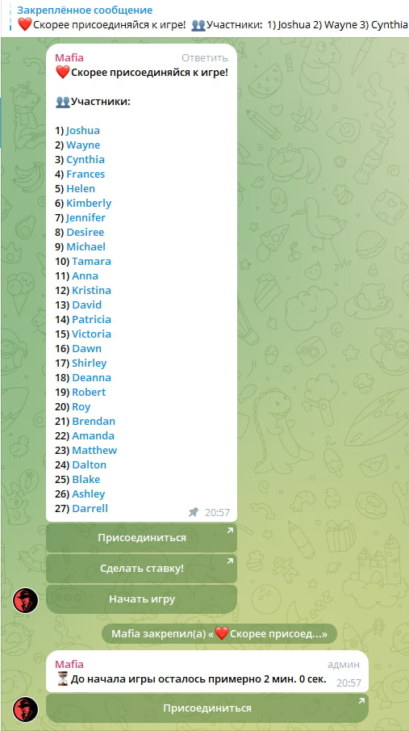

👨‍👩‍👧‍👧‍Бот работает в группах (и супергруппах), поэтому в первую очередь его нужно добавить в чат.
Так как игроков нужно информировать, временно блокировать выбывших и неиграющих или даже живых, напоминать о важных моментах, боту нужно выдать следующие права:

☑️Писать сообщения

☑️Удалять чужие сообщения

☑️Блокировать участников чата

☑️Закреплять сообщения

Без этого нельзя будет запустить процесс регистрации.

©️Если с правами все корректно, нужно ввести команду /registration, чтобы начать регистрацию. По умолчанию она длится 2 минуты, потом игра начинается. При необходимости продлить это время, администраторы или создатель игры могут ввести /extend и увеличить время на 30 секунд.

🛎️Регистрацию можно отменить, введя команду /revoke. Максимум регистрация длится 5 минут, затем игра автоматически начнётся. Игру можно запустить раньше, введя команду /go.

🎟️Присоединиться к игре можно, нажав на кнопку сообщением, а выйти с помощью команды /leave в группе. Имеется другой способ присоединиться: если подписаться на уведомления о начале регистрации в группе командой /subscribe, бот будет присылать в личку сообщение с дальнейшими инструкциями.

❗️Минимум в игре могут участвовать 4 человека, максимум 30. Если за время регистрации минимальное количество игроков не набралось, игра не запустится.

### 🃏Каков смысл ставок?
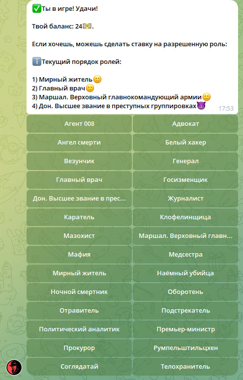
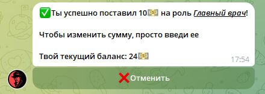


💰Во время регистрации любой игрок, который имеет ненулевой баланс, может сделать ставку на разрешенную роль (подробнее в разделе «⚙️Как настроить игру?️»).

🎲Так как заранее неизвестно, сколько игроков будет по итогу в игре, роль, на которую поставил игрок, может быть не задействована, в таком случае деньги возвращаются.

✅Если ставка зайдет, и роль будет в игре, игрок получит эту роль, а деньги спишутся.

😯Также ставки серьёзно влияют на то, какие в принципе роли будут в игре, если порядок ролей не определен явно или определен частично (об этом в разделе «⚙️Как настроить игру?»).

👥Предположим, что играют 6 человек. 5 ролей определены заранее, остался 1 слот. 
Если ставок не будет, то роль будет выбрана рандомно, а если ставки есть и они, 
например, такие: за «Кукловода» максимальная ставка 500, за «Соглядатого» 600, 
тогда 6-ой ролью будет «Соглядатай».

🔥В случае досрочного завершения игры (сбой телеграм, расформирование группы во время игры и т.д.) деньги за сделанные ставки вернутся в полном объеме.

### Как играть?

🎬Игра состоит из нескольких этапов:

🎁1) Знакомство

Бот присылает в личные сообщения краткую информацию о роли, знакомит с союзниками при наличии и в некоторых случаях с сокомандниками по группировке.

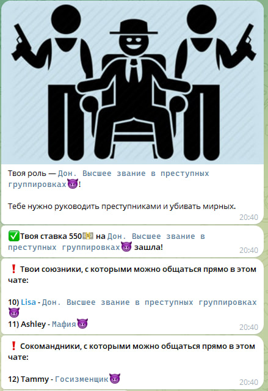

🌃2) Наступление ночи

Ночью бот присылает игрокам предложение что-то сделать в зависимости от особенностей полученной роли. Если роль неактивна ночью, сообщений приходить не будет.

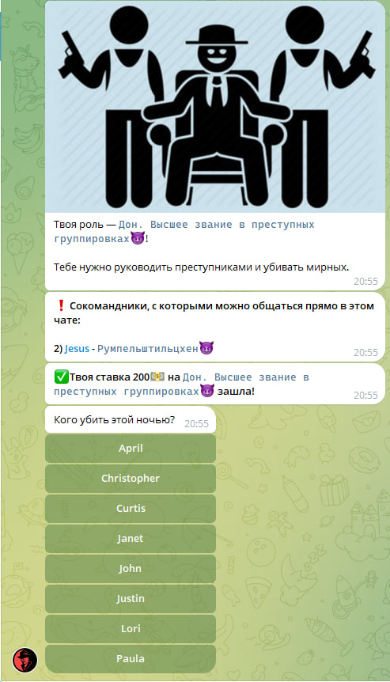

👿Проигнорировать это сообщение за игру можно 1 раз. В случае повторного невыполнения действия, игрок выбывает из игры до наступления следующей ночи и проигрывает по итогу вне зависимости от чего-либо.

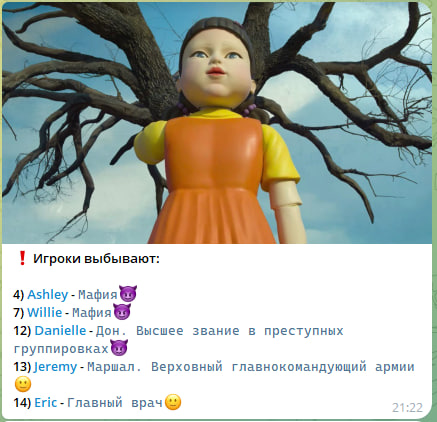

📅3) Наступление дня

После завершения ночных баталий бот подводит итоги, сообщает о погибших и присылает 
информацию о важных событиях в группу и личные сообщения игрокам. Жители в этот период обсуждают прошедшую ночь, всячески пытаются убедить других участников в своей правоте и невиновности.

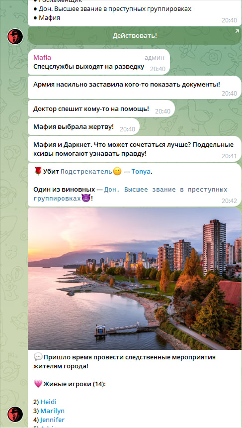

🤝4) Предложение голосовать за игрока, которого можно повесить

В личные сообщения игрокам приходит опросник, в котором можно выбрать живого участника игры для дальнейшего повешения или вариант никого не вешать. Участие в опросе также обязательно, если пропустить этот этап 2 раза за 1 кон, игрок выбывает и проигрывает.

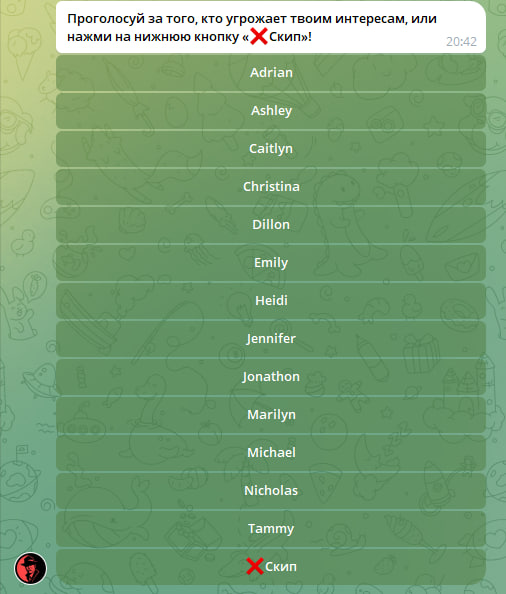
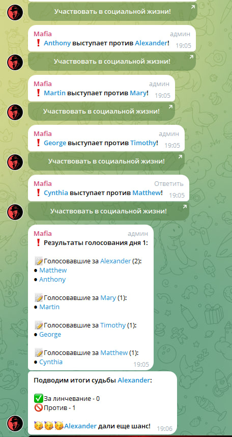

💀5) Подтверждение о повешении

Этот этап пропускается, если нет кандидата, набравшего бОльшее количество голосов на предыдущем шаге.
Если же такой кандидат имеется, в группу бот скидывает опрос с 2-мя вариантами ответа: 
повесить или нет. Если за повешение будет большинство, игрок будет кикнут из игры. 
Кандидат на повешение не может участвовать в опросе. Участие в подтверждении необязательно.


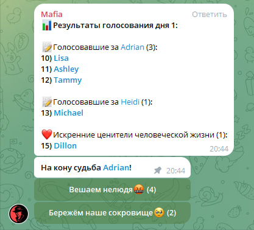
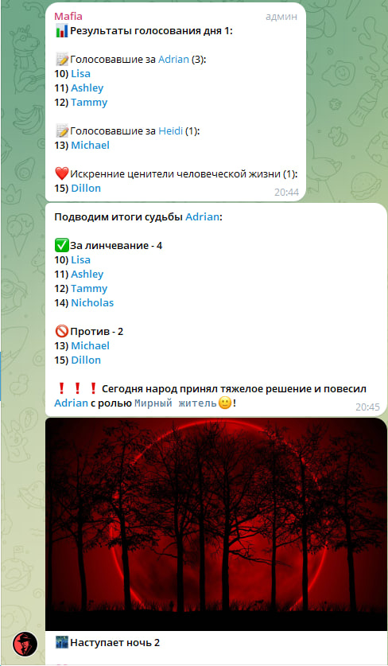

ℹ️Примечания:

🔚1) Игра заканчивается в тот момент, когда побеждает одна из группировок.

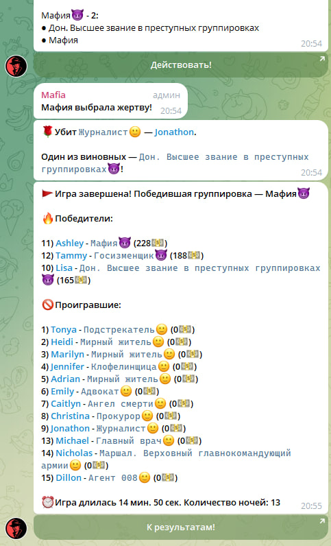

🏁2) Если игра уже началась, то завершить её досрочно победой группировки «Мирные жители🙂» можно тогда и только тогда, когда все живые участники введут /leave в личные сообщения боту.

🎙️3) После выбывания из игры ночью, бывший участник может написать последнее сообщение в личку боту, которое будет переслано в общий чат.
До смерти игрок может отправить сообщение анонимно, оплатив эту функцию в магазине /shop

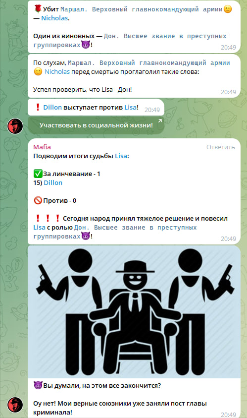

💬4) Во время игры коммуницировать прямо в боте могут союзники и все члены группировки «Мафия😈»


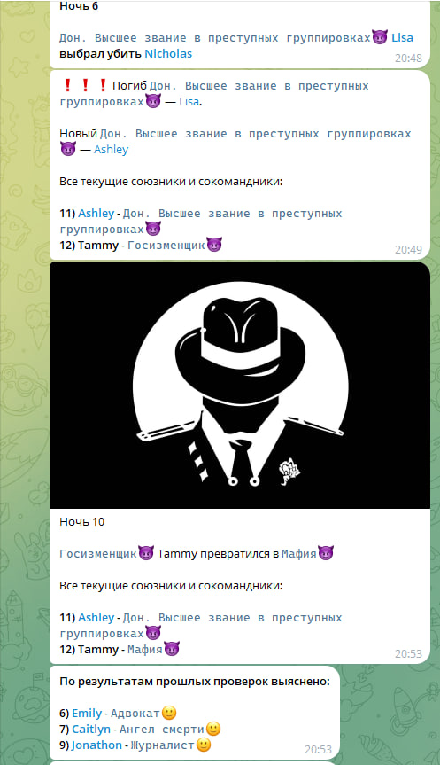

🤑5) Игрок может победить, даже если умер днём или ночью в зависимости от особенностей самой роли или группировки

### ⚙️Как настроить игру?
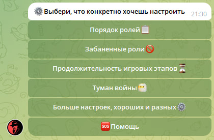
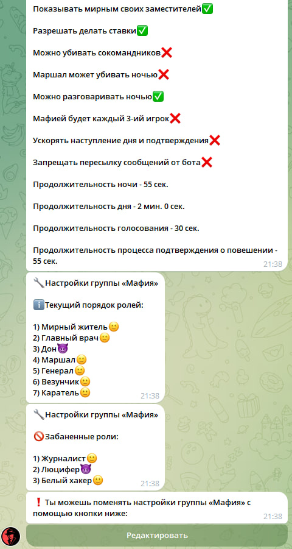


Чтобы настроить игру, введите команду /settings в группу. Бот пришлет в личные сообщения специфичный интерфейс: все участники группы увидят различные параметры, администраторы смогут из редактировать.

🛠Виды настроек:

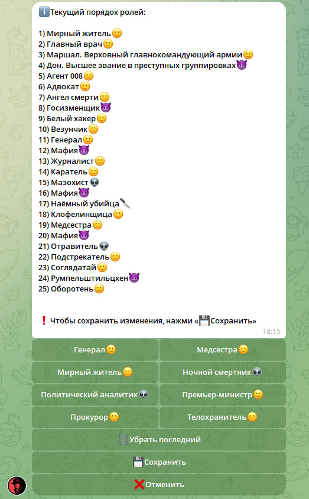

🗃️1) Порядок ролей

👥Количество игроков варьируется от игры к игре, поэтому пользователям предоставляется возможность явно определить, какие роли будут при определенном числе участников. Если порядок ролей определен для всех игроков (максимум 35), ставки не повлияют на отбор ролей в игру. Если вообще не определен, дело за ставками и рандомом.

❗️«Базовые роли» переопределять нельзя, ведь они должны участвовать в каждой игре. Информация о них будет отображена сразу при нажатии на кнопку. Также нельзя определить порядок для ролей, которые ранее были забанены. Роль из группировки «Мафия😈» может быть только на каждой 4-й или 3-й позиции: 4, 8, 12 или 3, 6, 9 и т.д. в зависимости от настроек.

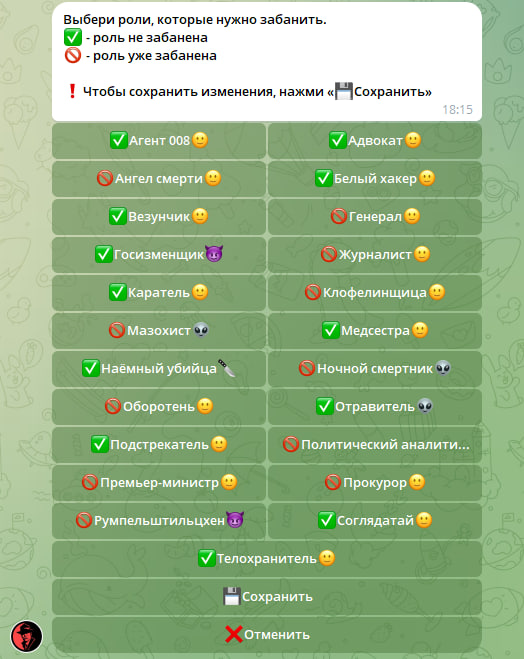

❌2) Забаненные роли

😁Нет обязательств играть сразу со всеми ролями. Если кто-то хочет поиграть в "самую обыкновенную" мафию с 4 ролями (мафия, мирный, доктор, комиссар) но с компанией из 20 человек, такая возможность есть!

Бот пришлет интерфейс, с помощью которого можно выбрать, какие роли в игре не смогут участвовать. Но участие не всех ролей можно ограничить. Есть так называемые «базовые роли», которые гарантированно будут в любой игре.

⏳3) Продолжительность игровых этапов

В этом разделе можно настроить:
- Продолжительность ночи
- Продолжительность дня
- Продолжительность голосования
- Продолжительность процесса подтверждения о повешении

😶‍🌫️4) Туман войны

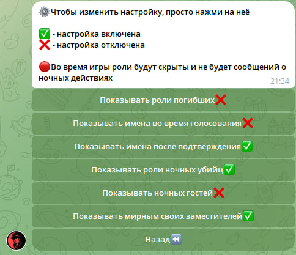

Туман войны — режим, который скрывает информацию во время игры. Его можно настраивать под себя:
- Показывать роли погибших — если игрока убили днём, ночью или из-за неактивности, то при включённой этой настройке информация о его роли будет сброшена в чат игры, иначе не будет
- Показывать имена во время голосования — если выключить эту настройку, во время голосования имена игроков будут скрыты, не будет видно, кто конкретно голосовал за жертву
- Показывать имена после подтверждения — если данная настройка включена, после результатов подтверждения бот пришлен информацию об участниках и их выборе в чат
- Показывать роли ночных убийц — после смерти игрока ночью бот присылает в чат информацию об одном из его убийц (не всех, кто пытался его убить). Если эта настройка будет выключена, информация будет скрыта
- Показывать ночных гостей — если кто-то взаимодействовал ночью с игроком, бот игроку присылает информацию об этом. Если настройка выключена, бот сообщит, что к игроку кто-то приходил, но не укажет роли
- Показывать мирным своих заместителей — общаться в чате бота, 
видеть имена друг друга и действия ночью могут все члены группировки «Мафия😈» и роли из других группировок, которые имеют союзников, заместителей. Чтобы отключить такую возможность для ролей, не входящих в группировку «Мафия😈», нужно выключить этот параметр

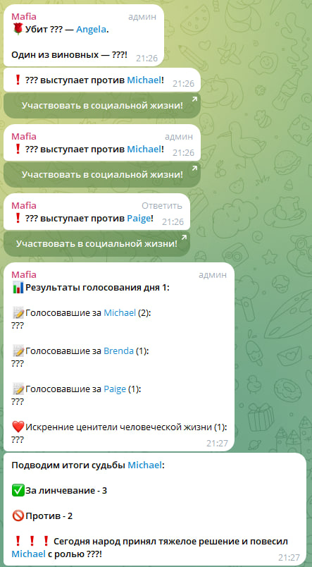

🛠️Другие настройки
- Разрешать делать ставки — если хочется, чтобы игроки получали роли совершенно рандомно, можно выключить эту настройку
- Можно убивать сокомандников — сокомандники могут ночью убить друг друга, но если такое поведение нежелательно, нужно выключить эту настройку. Если сокомандники не видят друг друга, настройка будет включена автоматически
- Маршал может убивать ночью — у данной роли есть 2 опции на выбор: проверить или стрелять. Чтобы оставить только первую опцию, отключите данную настройку
- Можно разговаривать ночью — если настройка отключена, бот удаляет сообщения и банит пользователей за общение ночью
- Мафией будет каждый 3-ий игрок — если нужно, чтобы мафий или ее сокомандников в игре было больше, включите эту настройку. Иначе мафией будет каждый 4-ый. В случае, если настройка изменится, а ранее был настроен порядок ролей, то он сбросится
- Ускорять наступление дня и этапа подтверждения — можно выставить длительность ночи 3 минуты, но если включена данная настройка, и все игроки успели сделать ход, ночь может завершиться через секунд 20. То же самое с этапом голосования
- Запрещать пересылку сообщений от бота — если включить данную настройку, телеграм будет запрещать пересылать и копировать большинство сообщений от бота в личке во время игры

### Как посмотреть статистику?
🥇1) После ночи бот присылает в личку информацию о действиях, которые каким-либо образом повлияли на игру. 
Например, если доктор вылечил игрока, которого и не пытались убить, ему об этом не сообщат.

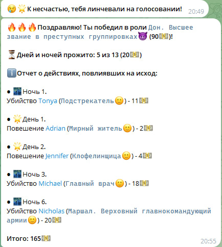

👤2) По команде /profile в личные сообщения бот пришлет подробнейшую информацию об игроке, его играх и результатах

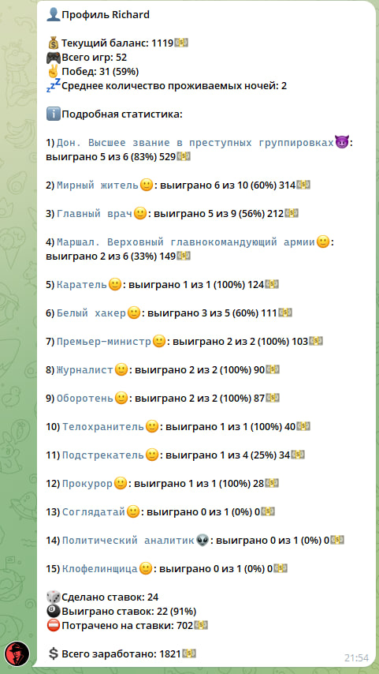

📊3) По команде /statistics в сообщения группы бот пришлет в общий чат информацию о группе и рейтинге игроков

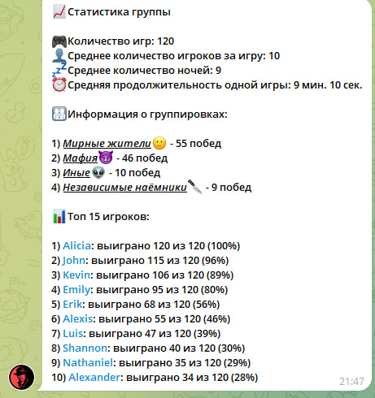

### Какие есть роли?
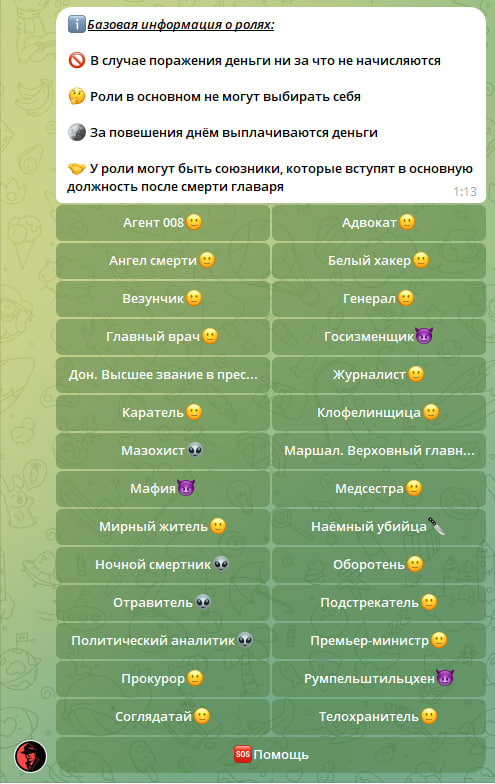


Чтобы подробнее ознакомиться с ролями, в личку боту можно отправить команду /help и зайти в раздел «Роли🎭».
Кликнув на любую роль, пользователь получит подробную информацию о ней

## Установка

* Убедитесь, что docker установлен на локальной машине ([Как установить Docker?](https://docs.docker.com/get-started/get-docker/))
* Склонируйте репозиторий на локальную машину
```sh
git clone https://github.com/XXSnape/mafia.git
```
* Создайте файл .env co своими данными и скопируйте все из .env_template,
либо введите свои данные
* Запустите докер контейнер и подождите около 2 минут
```sh
docker compose up
```
### Данные в .env_template

#### BOT_TOKEN - Токен от [BotFather](https://t.me/BotFather)
#### BOT_URL - URL бота
#### DB_HOST - Хост базы данных
#### DB_PORT - Порт базы данных
#### POSTGRES_USER - Логин пользователя 
#### POSTGRES_PASSWORD - Пароль пользователя
#### POSTGRES_DB - Название базы данных
#### MAFIA_INIT_DB - Значение, указывающее на то, нужно ли инициализировать базу данных (необходимо указать True при первом запуске, потом сменить на False)
#### MAFIA_MAXIMUM_NUMBER_OF_PLAYERS - Максимальное количество игроков в игре
#### MAFIA_MINIMUM_NUMBER_OF_PLAYERS - Минимальное количество игроков в игре
#### MAFIA_MAXIMUM_REGISTRATION_TIME - Максимальное время регистрации (в минутах)
#### RABBITMQ_DEFAULT_USER - Логин для брокера сообщений
#### RABBITMQ_DEFAULT_PASS - Пароль для брокера сообщений
#### RABBITMQ_HOST - Хост для брокера сообщений
#### RABBITMQ_PORT - Порт для брокера сообщений
#### REDIS_HOST - Хост для Redis
#### REDIS_PORT - Порт для Redis

## Использованные инструменты и технологии
* ### [Aiogram](https://aiogram.dev/)
* ### [Pydantic](https://docs.pydantic.dev/latest/)
* ### [SQLAlchemy](https://www.sqlalchemy.org/)
* ### [Alembic](https://alembic.sqlalchemy.org/en/latest/index.html)
* ### [Redis](https://pypi.org/project/redis/)
* ### [FastStream](https://faststream.airt.ai/latest/)
* ### [APScheduler](https://apscheduler.readthedocs.io/en/stable/userguide.html)
* ### [Loguru](https://loguru.readthedocs.io/en/stable/overview.html)